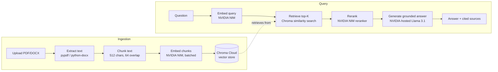

# ContextQuery — Backend

Grounded document Q&A. Upload a PDF or DOCX, ask a question, get an answer that's traceable to the exact passage it came from — nothing invented, nothing pulled from outside the document.

**Live API:** [contextquery-backend.onrender.com](https://contextquery-backend.onrender.com) · [Interactive docs](https://contextquery-backend.onrender.com/docs)
**Frontend:** [contextquery-frontend.vercel.app](https://contextquery-frontend.vercel.app)

Built end-to-end on free-tier infrastructure — zero paid API spend.

---

## What it does

1. Upload a PDF or DOCX
2. Text is extracted, chunked, embedded, and stored in a vector database
3. Ask a question in plain language
4. The system retrieves the most relevant chunks, reranks them for precision, and generates an answer using *only* that retrieved context
5. Every answer ships with citations back to the source filename and chunk

If the documents don't contain an answer, the system says so — it doesn't fall back on the LLM's own training knowledge. That constraint is the entire point of the project.

---

## Architecture



### Stack

| Layer | Technology | Why |
|---|---|---|
| Frontend | Next.js 15 (App Router), Tailwind, shadcn/ui → Vercel | Free tier, zero-config deploys |
| Backend | FastAPI, Python 3.11 (Docker) → Render | Async-native, fast to build |
| Embeddings | NVIDIA NIM (`llama-nemotron-embed-1b-v2`) | Free hosted tier, no local GPU needed |
| Reranker | NVIDIA NIM (`llama-nemotron-rerank-1b-v2`) | Same free tier, meaningfully improves retrieval precision |
| LLM | NVIDIA NIM (`meta/llama-3.1-8b-instruct`) | Free hosted inference — see [why not Ollama in production](#why-not-ollama-in-production) |
| Vector store | Chroma Cloud (free tier) | See [why not local ChromaDB](#why-not-local-chromadb-in-production) |
| File parsing | pypdf, python-docx | Standard, no paid OCR needed for text-based docs |

---

## API

| Method | Endpoint | Purpose |
|---|---|---|
| `POST` | `/api/ingest` | Upload and process a document |
| `POST` | `/api/query` | Ask a question, get a complete answer |
| `POST` | `/api/query/stream` | Ask a question, stream the answer token-by-token (SSE) |
| `GET` | `/api/documents` | List all ingested documents |
| `DELETE` | `/api/documents/{id}` | Remove a document and its chunks |
| `GET` | `/health` | Health check |

Full interactive docs at [`/docs`](https://contextquery-backend.onrender.com/docs).

---

## Local development

```bash
git clone https://github.com/vivekpatil200320/contextquery-backend.git
cd contextquery-backend
python3.11 -m venv venv
source venv/bin/activate
pip install -r requirements.txt
```

`.env`:
```
NVIDIA_API_KEY=your_key_from_build.nvidia.com
LLM_PROVIDER=ollama          # "ollama" for local dev, "nvidia" for deployed
NVIDIA_LLM_MODEL=meta/llama-3.1-8b-instruct
CHROMA_PERSIST_DIR=./chroma_db
```

```bash
ollama serve &
ollama pull llama3
uvicorn app.main:app --reload --port 8000
```

### Docker

```bash
docker buildx build --platform linux/amd64 -t contextquery-backend .
docker run --platform linux/amd64 -p 8000:8000 --env-file .env contextquery-backend
```

---

## Technical challenges and decisions

The honest version of how this got built — not because the mess is interesting, but because the decisions made under each constraint say more about engineering judgment than a clean changelog would.

### Python 3.14 → 3.11 for the Docker image

Local development started on Python 3.14 (newest available at the time). It worked fine locally. It would *not* have worked in the Docker image: several dependencies — `onnxruntime`, `grpcio`, `tokenizers` (transitive deps of ChromaDB and the embedding stack) — had no prebuilt wheels for 3.14 yet, meaning the container would either fail to build or silently compile from source on every deploy. Rather than fight bleeding-edge Python compatibility in a place where it didn't matter, the Docker image pins to `python:3.11-slim` — a deliberately conservative choice for the one environment where stability matters more than having the newest interpreter.

### Ollama → NVIDIA NIM for the LLM

The original plan was "Ollama for dev, paid API for the live demo." Two things made that the wrong framing:

- Render's free tier has no GPU and limited RAM — it cannot run Ollama with a loaded model at all, regardless of cost
- NVIDIA NIM's hosted free tier provides the same Llama models Ollama would run locally, with no local resource constraints

The LLM provider is a runtime switch (`LLM_PROVIDER` env var), not a code fork — `ollama` for fast local iteration with zero rate limits, `nvidia` for anywhere the app actually needs to run unattended. This solved the deployment problem and avoided introducing a paid API at the same time.

### Why not local ChromaDB in production

`PersistentClient` writes to local disk. Render's free tier filesystem is **ephemeral** — anything written to disk is wiped on every redeploy or cold restart. The first deploy worked perfectly and then lost all ingested documents on the next push, which is the textbook failure mode of treating a stateless container's filesystem as durable storage. Migrated to Chroma Cloud's free tier, which is the actual source of truth now — local `chroma_db/` only exists for offline dev convenience and is gitignored.

### Why not local ChromaDB in production (the longer version)

This is the kind of bug that's invisible until the exact moment it matters — everything passes locally, everything passes in the first deploy, and then a week later the "working" demo has silently lost its data. Worth designing around proactively rather than discovering reactively, especially for anything going in front of a client.

### SSL certificate verification on macOS Python 3.14

Python installed via the python.org installer (rather than a system package manager) doesn't always link to the OS certificate store on macOS, which surfaced as `SSL: CERTIFICATE_VERIFY_FAILED` errors calling NVIDIA's API — nothing to do with NVIDIA's certificates being invalid, entirely a local environment quirk. Fixed by explicitly pointing `SSL_CERT_FILE`/`REQUESTS_CA_BUNDLE` at `certifi`'s bundle as OS-level environment variables (not in `.env` — Pydantic Settings treats unknown `.env` keys as model fields and rejects them, so infrastructure-level config like this is kept separate from application config).

### Batched embeddings, not one-call-per-chunk

A naive ingestion loop that embeds one chunk per API call doesn't just waste rate limit — for a large document it turns a few-second operation into a multi-minute one with hundreds of round trips. Embeddings are sent in sub-batches (96 chunks per request) to stay under NVIDIA NIM's per-request limits while still minimizing total API calls.

### Large documents need async ingestion, not just a bigger size limit

A 950-page document chunks into several thousand pieces — embedding all of them synchronously within a single HTTP request risks exceeding Render's request timeout entirely, independent of the file size limit. Ingestion runs as a background task; the upload endpoint returns immediately with a `document_id`, and a status endpoint reports embedding progress until completion. The file size cap itself (20MB) reflects what's realistic for a free-tier demo, not a hard technical ceiling — it's a deliberate scope decision, documented rather than silently assumed.

---

## What's not built (yet)

- Conversation memory across queries (each question is currently independent)
- Job status persistence across server restarts (in-memory tracking resets on redeploy — fine for a demo, would move to Postgres for anything long-running)
- OCR for scanned/image-based PDFs (text-based documents only)

---

## License

MIT
